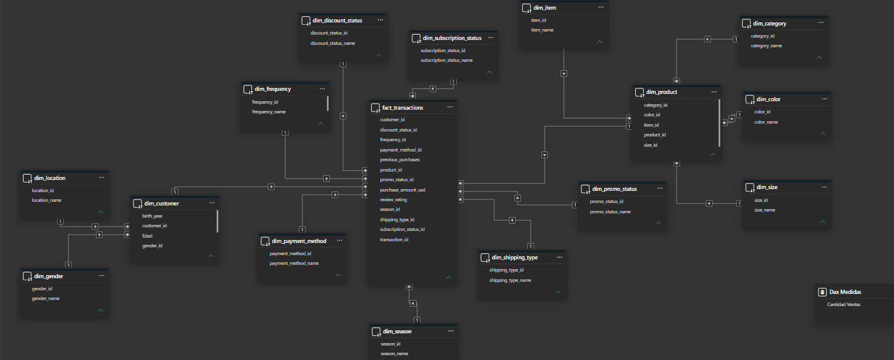
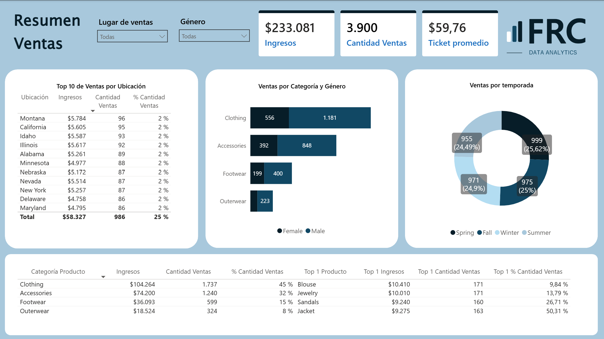
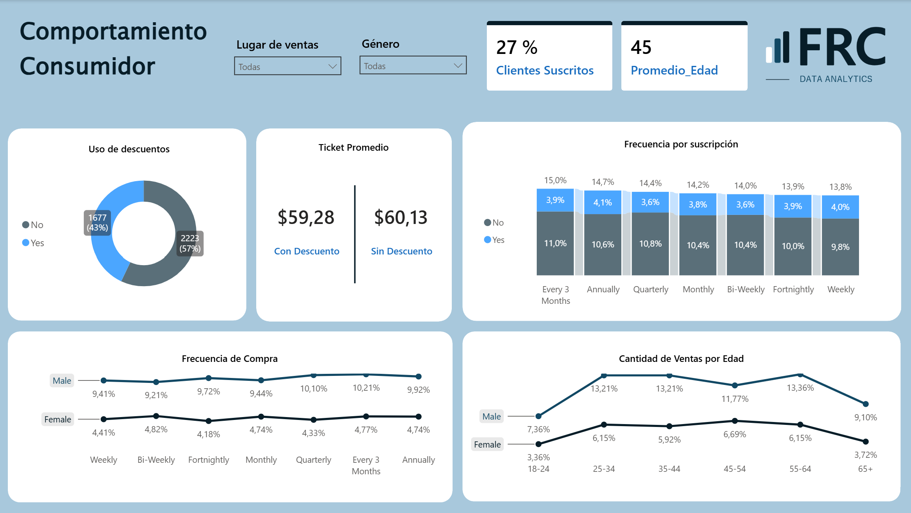

# Consumer Behavior Dashboard

Análisis de las ventas del negocio y comportamiento del consumidor 
usando Python, SQL Server y Power BI.

---

## Herramientas utilizadas
- **Python** — limpieza y carga de datos a SQL Server
- **SQL Server** — modelado de datos en copo de nieve
- **Power BI** — visualización e insights

---

## Estructura del proyecto
mi_dashboard_project/
```
├── data/          → Dataset original CSV
├── sql/           → Script de creación de tablas
├── scripts/       → Script Python para poblar la BD
├── dashboard/     → Archivo Power BI (.pbix)
├── design/        → Logo, paleta de colores y tema
└── images/        → Capturas de las vistas
```
---

## Modelo de datos
Modelo copo de nieve (Snowflake Schema) con tabla central 
de hechos y dimensiones normalizadas:

- **fact_transactions** — tabla central de transacciones
- **dim_customer** → dim_gender, dim_location
- **dim_product** → dim_item, dim_category, dim_color, dim_size
- **dim_payment_method, dim_shipping_type** — comportamiento
- **dim_frequency, dim_season, dim_discount_status** — atributos



---

## Dashboard

### Vista 1 — Resumen de Ventas


### Vista 2 — Comportamiento del Consumidor


---

## Principales insights

### Resumen de Ventas

- **Ventas estables todo el año** — Las ventas por temporada se mantienen 
  prácticamente constantes con una variación menor al 1% entre estaciones, 
  lo que indica una demanda uniforme sin picos estacionales.

- **Clothing domina el mercado** — Es la categoría más vendida con $104,264 
  en ingresos, representando el 45% del total de ventas.

- **Producto estrella por género** — Dentro de Clothing, la Blouse es el 
  top 1 entre mujeres mientras que Pants lidera entre hombres.

- **Los hombres generan mayor volumen de compras** — Son el segmento con 
  más transacciones e ingresos en todas las categorías.

- **Ticket promedio de $59.76** — Promedio general de gasto 
  por compra en el periodo analizado.

---

### Comportamiento del Consumidor

- **Baja tasa de suscripción** — Solo el 27% de los clientes tiene 
  suscripción activa y esta no influye en la frecuencia de compra, 
  lo que sugiere que el programa de suscripción no incentiva 
  mayor lealtad ni frecuencia de compra en los clientes.

- **Público objetivo de 45 años** — La edad promedio del cliente es 45 años. 
  Los hombres de 55-64 años son los mayores consumidores, mientras que 
  las mujeres de 45-54 años lideran en su segmento.

- **Los descuentos no impactan las ventas** — El uso de descuentos no 
  influye significativamente ni en la cantidad vendida ni en los ingresos.

- **El descuento reduce mínimamente el ticket** — Los clientes con descuento 
  gastan $59.28 vs $60.13 sin descuento, una diferencia menor al 1% 
  que no representa un impacto real en los ingresos.

- **Frecuencia de compra diferente por género** — Las mujeres compran 
  con mayor frecuencia (2 veces por semana) mientras que los hombres 
  compran cada 3 meses. Sin embargo, los hombres generan mayor volumen 
  de compras e ingresos en términos absolutos.

---

## Cómo ejecutar
1. Ejecutar `sql/create_tables_sql_server.sql` en SQL Server
2. Ejecutar `scripts/poblar_bd_SQLSERVER.py` para cargar los datos
3. Abrir `dashboard/dashboard_consumer_behavior2.pbix` en Power BI
